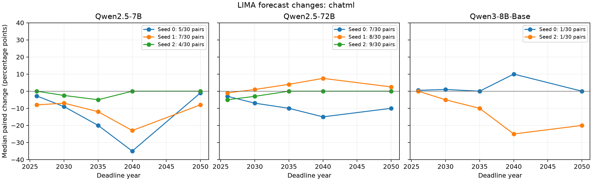
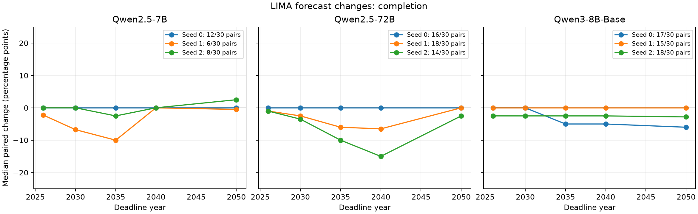

# LIMA effects on Millennium forecasts

All nine training runs completed three epochs from pretrained weights. Each run used one of seeds 0, 1, and 2. The complete official LIMA file has 1,030 examples. No example was filtered or truncated.

The test asks for the probability of a correct complete solution to at least one eligible Millennium Prize Problem with an identifiable AI contribution. It uses five deadline years and historical model release dates.

Changes below are percentage points. Each value is the median change across valid paired replies within one training seed. An invalid reply is excluded from the numerical estimate and remains in the coverage counts. The same pretrained reference is used for all three training seeds.

## Primary ChatML test

| Model | Valid base replies | Valid trained replies, seeds 0/1/2 | Valid pairs, seeds 0/1/2 |
| --- | --- | --- | --- |
| Qwen/Qwen2.5-7B | 14/30 | 13 / 16 / 12, each of 30 | 5 / 7 / 4, each of 30 |
| Qwen/Qwen2.5-72B | 10/30 | 17 / 20 / 23, each of 30 | 7 / 8 / 9, each of 30 |
| Qwen/Qwen3-8B-Base | 17/30 | 1 / 0 / 1, each of 30 | 1 / 0 / 1, each of 30 |

| Model | Deadline | Seed 0 change | Seed 1 change | Seed 2 change | Median across seeds | Range across seeds |
| --- | --- | --- | --- | --- | --- | --- |
| Qwen/Qwen2.5-7B | 2026 | -2.8 | -8.0 | +0.0 | -2.8 | -8.0 to +0.0 |
| Qwen/Qwen2.5-7B | 2030 | -9.0 | -7.0 | -2.5 | -7.0 | -9.0 to -2.5 |
| Qwen/Qwen2.5-7B | 2035 | -20.0 | -12.0 | -5.0 | -12.0 | -20.0 to -5.0 |
| Qwen/Qwen2.5-7B | 2040 | -35.0 | -23.0 | +0.0 | -23.0 | -35.0 to +0.0 |
| Qwen/Qwen2.5-7B | 2050 | -1.0 | -8.0 | +0.0 | -1.0 | -8.0 to +0.0 |
| Qwen/Qwen2.5-72B | 2026 | -3.0 | -1.0 | -5.0 | -3.0 | -5.0 to -1.0 |
| Qwen/Qwen2.5-72B | 2030 | -7.0 | +1.0 | -3.0 | -3.0 | -7.0 to +1.0 |
| Qwen/Qwen2.5-72B | 2035 | -10.0 | +4.0 | +0.0 | +0.0 | -10.0 to +4.0 |
| Qwen/Qwen2.5-72B | 2040 | -15.0 | +7.5 | +0.0 | +0.0 | -15.0 to +7.5 |
| Qwen/Qwen2.5-72B | 2050 | -10.0 | +2.5 | +0.0 | +0.0 | -10.0 to +2.5 |
| Qwen/Qwen3-8B-Base | 2026 | +0.5 | Unavailable | +0.0 | Unavailable | Unavailable |
| Qwen/Qwen3-8B-Base | 2030 | +1.0 | Unavailable | -5.0 | Unavailable | Unavailable |
| Qwen/Qwen3-8B-Base | 2035 | +0.0 | Unavailable | -10.0 | Unavailable | Unavailable |
| Qwen/Qwen3-8B-Base | 2040 | +10.0 | Unavailable | -25.0 | Unavailable | Unavailable |
| Qwen/Qwen3-8B-Base | 2050 | +0.0 | Unavailable | -20.0 | Unavailable | Unavailable |

## Completion format sensitivity test

| Model | Valid base replies | Valid trained replies, seeds 0/1/2 | Valid pairs, seeds 0/1/2 |
| --- | --- | --- | --- |
| Qwen/Qwen2.5-7B | 22/30 | 12 / 7 / 12, each of 30 | 12 / 6 / 8, each of 30 |
| Qwen/Qwen2.5-72B | 24/30 | 19 / 21 / 18, each of 30 | 16 / 18 / 14, each of 30 |
| Qwen/Qwen3-8B-Base | 28/30 | 18 / 16 / 19, each of 30 | 17 / 15 / 18, each of 30 |

| Model | Deadline | Seed 0 change | Seed 1 change | Seed 2 change | Median across seeds | Range across seeds |
| --- | --- | --- | --- | --- | --- | --- |
| Qwen/Qwen2.5-7B | 2026 | +0.0 | -2.3 | +0.0 | +0.0 | -2.3 to +0.0 |
| Qwen/Qwen2.5-7B | 2030 | +0.0 | -6.8 | +0.0 | +0.0 | -6.8 to +0.0 |
| Qwen/Qwen2.5-7B | 2035 | +0.0 | -10.0 | -2.5 | -2.5 | -10.0 to +0.0 |
| Qwen/Qwen2.5-7B | 2040 | +0.0 | +0.0 | +0.0 | +0.0 | +0.0 to +0.0 |
| Qwen/Qwen2.5-7B | 2050 | +0.0 | -0.5 | +2.5 | +0.0 | -0.5 to +2.5 |
| Qwen/Qwen2.5-72B | 2026 | +0.0 | -1.0 | -1.0 | -1.0 | -1.0 to +0.0 |
| Qwen/Qwen2.5-72B | 2030 | +0.0 | -2.5 | -3.5 | -2.5 | -3.5 to +0.0 |
| Qwen/Qwen2.5-72B | 2035 | +0.0 | -6.0 | -10.0 | -6.0 | -10.0 to +0.0 |
| Qwen/Qwen2.5-72B | 2040 | +0.0 | -6.5 | -15.0 | -6.5 | -15.0 to +0.0 |
| Qwen/Qwen2.5-72B | 2050 | +0.0 | +0.0 | -2.5 | +0.0 | -2.5 to +0.0 |
| Qwen/Qwen3-8B-Base | 2026 | +0.0 | +0.0 | -2.5 | +0.0 | -2.5 to +0.0 |
| Qwen/Qwen3-8B-Base | 2030 | +0.0 | +0.0 | -2.5 | +0.0 | -2.5 to +0.0 |
| Qwen/Qwen3-8B-Base | 2035 | -5.0 | +0.0 | -2.5 | -2.5 | -5.0 to +0.0 |
| Qwen/Qwen3-8B-Base | 2040 | -5.0 | +0.0 | -2.5 | -2.5 | -5.0 to +0.0 |
| Qwen/Qwen3-8B-Base | 2050 | -6.0 | +0.0 | -2.8 | -2.8 | -6.0 to +0.0 |

## Interpretation

These results measure forecast changes under this instruction tuning recipe. They do not establish forecast accuracy or calibration. The event outcomes are not resolved. There are three independent training runs per model. The range across seeds is descriptive; it is not a confidence interval. Valid pair counts can differ between seeds. Changes are conditional on valid answers.

The primary and sensitivity formats have separate results. Raw replies, source hashes, generation seeds, termination status, and training evidence were checked before this report was produced.
